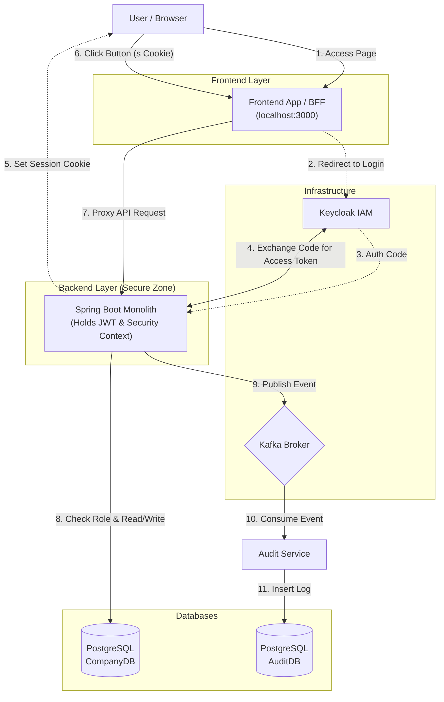

# Company HR & Asset Management System

A full-stack system for managing employees, assets, and organizational structure with secured access via Keycloak and asynchronous event processing via Kafka.

---
## 🏗️ Architecture


---
## 🛠️ Tech Stack

### Backend & Build

| Technology | Version | Purpose |
| :--- | :--- | :--- |
| **Java** | 21 (LTS) | Core language features |
| **Spring Boot** | 4.0.0 | Application framework |
| **Spring Security** | 6.x | OAuth2 Resource Server (JWT Handling) |
| **Spring Data JDBC** | Latest | Simple & Fast Object-Relational mapping (No Hibernate magic) |
| **Gradle** | 8.x (Kotlin DSL) | Build automation tool |
| **Flyway** | 10.x | Database migration & version control |
| **Spring Boot Actuator** | Latest | Health checks, metrics & monitoring |

### Testing & Quality Assurance

| Technology | Purpose |
| :--- | :--- |
| **JUnit 5** | Unit testing framework |
| **Testcontainers** | Integration testing with real Docker containers (PostgreSQL, Kafka) |
| **Mockk** | Mocking library (Preferred for Kotlin) |

### Infrastructure & Data

| Technology | Purpose |
| :--- | :--- |
| **PostgreSQL** | Primary relational database |
| **Kafka** | Event streaming platform |
| **Keycloak** | Identity & Access Management (IAM) |
| **Docker Compose** | Local environment orchestration |


---
📚 Documentation & Manuals
Detailed guides for specific parts of the infrastructure can be found in the manuals/ directory:
- [**Kafka Guide**](manuals/kafka.md)
- [**Keycloak Setup**](manuals/keycloak.md)
- [**Database & Flyway**](manuals/database.md)
  
---
## 📁 Project Modules (Future Growth)

| Module | Description | Status |
|--------|-------------------------|--------|
| **company-app** | Primary monolithic backend service| 🟡 In progress |
| **audit-service** | Auditing via Kafka | 🟡 In progress |

---
## 💻 Prerequisites
Before running the project, ensure you have the following installed:
- Java JDK 21
- Docker & Docker Compose / Docker Desktop
- Maven or Gradle (this project using Gradle)
- Intelijj IDEA (Recommended for Kotlin)

---
## ⚙️ Environment Configuration

Create a `.env` file in the root directory with the following content:

```env
# Company App Database
POSTGRES_DB=companydb
POSTGRES_USER=companyuser
POSTGRES_PASSWORD=strongpassword
POSTGRES_PORT=5432

# Keycloak Database
KEYCLOAK_DB=keycloakdb
KEYCLOAK_DB_USER=keycloak
KEYCLOAK_DB_PASSWORD=keycloakpassword

# Keycloak Admin Login
KEYCLOAK_ADMIN=admin
KEYCLOAK_ADMIN_PASSWORD=adminpassword
KEYCLOAK_PORT=8081

# Kafka
KAFKA_BOOTSTRAP_SERVERS=localhost:9092

# Application Config
SPRING_PROFILES_ACTIVE=dev
SERVER_PORT=8082
```

---
## 🚀 How to Run
1. Start Infrastructure (Docker)
To start the database, Keycloak, and Kafka services:
```bash
# Start all containers in detached mode
start-env.sh
```

2. Configure Keycloak (First Run)
    - Access Keycloak at http://localhost:8081 (Admin: admin / adminpassword).
    - Import Realm: Go to Create Realm -> Upload config/keycloak/realm-export.json (if available).
    - Or Manual Setup: Create a client company-app-backend with Confidential access type.

3. Start the Application auditLog and company-app
```bash
# Using Gradle
./gradlew bootRun

# Using Maven
./mvnw spring-boot:run
```
The monolith application company-app will be available at http://localhost:8082.

4. Stopping the Environment
```bash
# Stop containers
./stop-env.sh

# Stop and remove volumes (RESET DATA)
./remove-env.sh
```

---
📖 API Documentation (In Progress)

Once the application is running, you can explore the REST API via Swagger UI:
- Swagger UI:
- OpenAPI JSON:
    
---
## 🗄️ Database Configuration (pgAdmin4)
Access pgAdmin4 to manage your databases visually. The server connections are **automatically provisioned** via `servers.json` upon container startup.

**pgAdmin Login:**
- **URL:** `http://localhost:5050`
- **Email:** `admin@admin.com`
- **Password:** `admin`

### 🔌 Pre-configured Connections
Once logged in, expand the **Servers** group in the left sidebar. You will see the databases already registered. Simply double-click to connect and enter the password when prompted.


| Server Name (in UI) | Database Name | Username | Password (from .env) |
|---------------------|---------------|----------|----------------------|
| **Company App DB** | `companydb` | `companyuser` | `strongpassword` |
| **Keycloak DB** | `keycloakdb` | `keycloak` | `keycloakpassword` |
| **Audit Log Service DB** | `auditlogdb` | `auditloguser` | `auditlogpassword` |

> **Note:** Since pgAdmin runs within the Docker network, it connects to databases using their service names (e.g., `company-postgres`) internally. You do not need to configure IPs manually.


